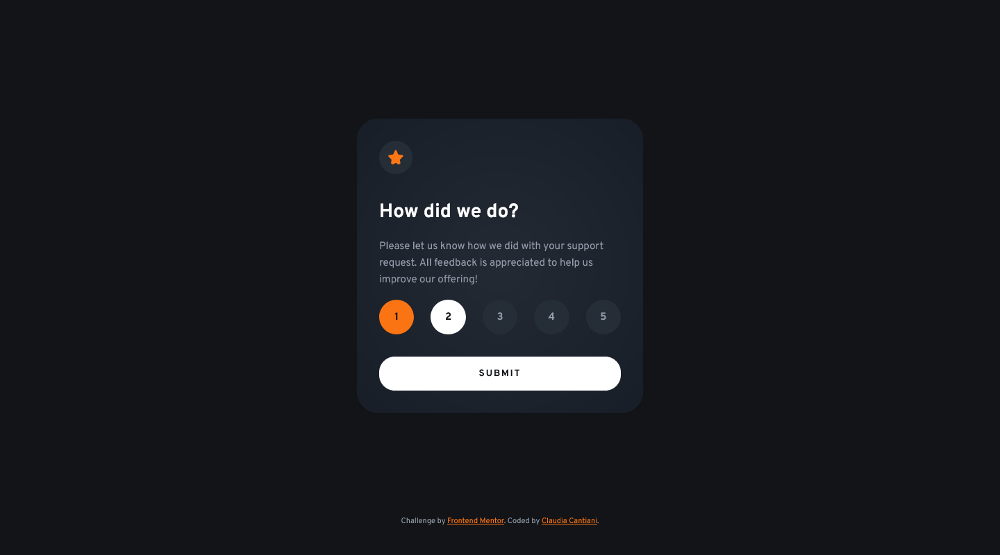
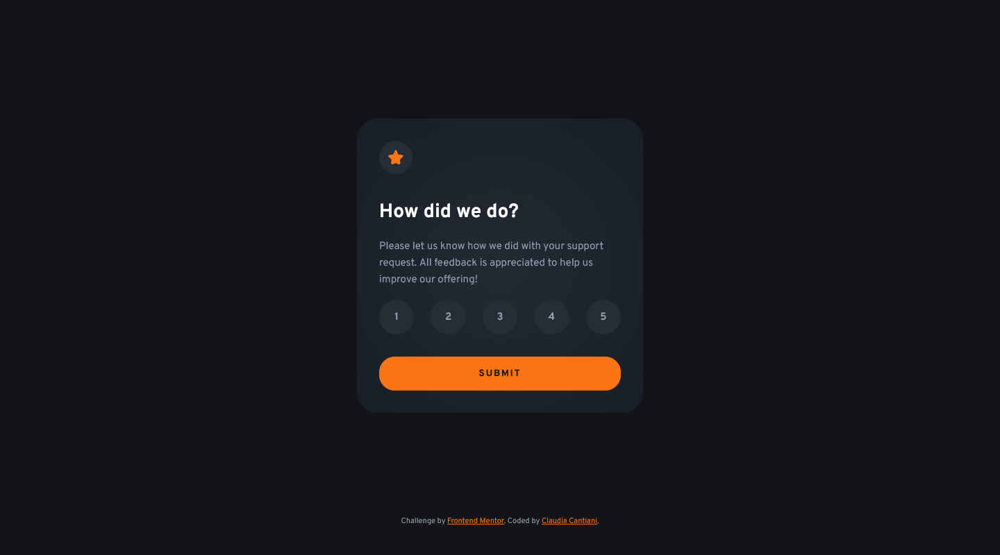
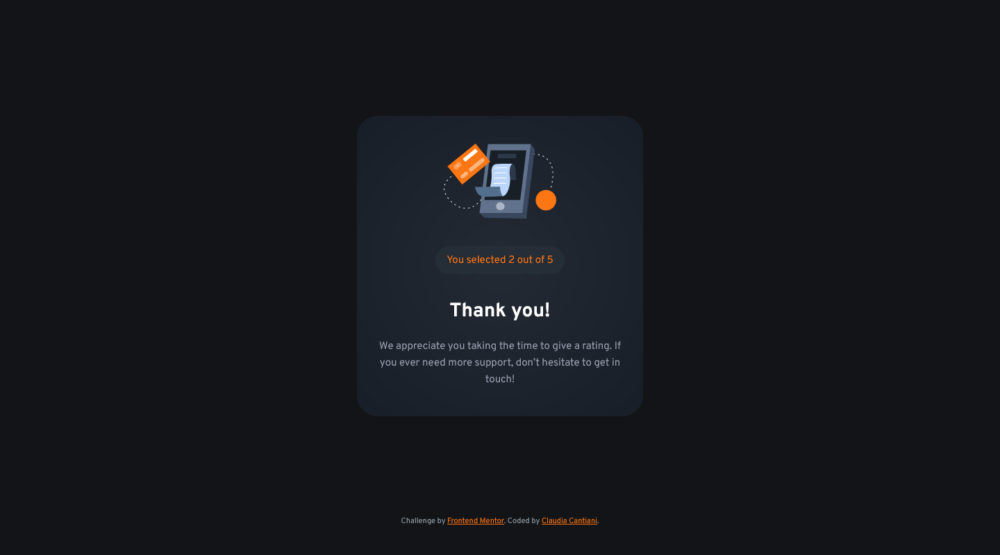
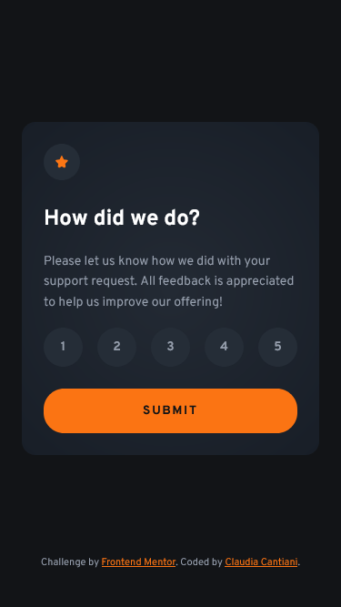

# Frontend Mentor - Interactive rating component solution

This is a solution to the [Interactive rating component challenge on Frontend Mentor](https://www.frontendmentor.io/challenges/interactive-rating-component-koxpeBUmI). Frontend Mentor challenges help you improve your coding skills by building realistic projects.

## Table of contents

- [Overview](#overview)
  - [The challenge](#the-challenge)
  - [Screenshot](#screenshot)
  - [Links](#links)
- [My process](#my-process)
  - [Built with](#built-with)
  - [What I learned](#what-i-learned)
  - [Useful resources](#useful-resources)
- [Author](#author)

## Overview

### The challenge

Users should be able to:

- View the optimal layout for the app depending on their device's screen size
- See hover states for all interactive elements on the page
- Select and submit a number rating
- See the "Thank you" card state after submitting a rating

### Screenshot

### Links

- Solution URL: [Add solution URL here](https://your-solution-url.com)
- Live Site URL: [Add live site URL here](https://your-live-site-url.com)

## My process

### Built with

- Semantic HTML5 markup
- CSS custom properties
- Flexbox
- CSS Grid
- Mobile-first workflow
- Vanilla JavaScript

### What I learned

This project provided a great opportunity to reinforce and learn new concepts, particularly around custom form element styling and accessibility:

Custom Radio Button Styling: I learned how to effectively hide the default browser appearance of radio inputs using `appearance: none;` and `opacity: 0;` while maintaining their functionality.
`css
    .rating-form input[type="radio"] {
        appearance: none;
        width: 100%;
        height: 100%;
        opacity: 0;
        position: absolute;
        top: 0;
        left: 0;
        cursor: pointer;
        z-index: 1;
        outline: none; /* Crucial for custom focus styling */
    }
    `
Accessibility for Custom Inputs: A key learning was ensuring keyboard navigability and visible focus states for custom-styled radio buttons. By applying styles to the parent `<label>` when its contained `input` is focused using `:focus-within`, the user can clearly see which option they are interacting with via keyboard.
`css
    .rating-form label:focus-within {
        background-color: var(--white);
        color: var(--color-950);
    }
    `
State Management with JavaScript: I implemented JavaScript to handle the dynamic transition between the initial rating state and the "Thank You" state, including capturing and displaying the user's selected rating. This involved toggling `hidden` classes and updating text content.
`js
    ratingForm.addEventListener('submit', (event) => {
        event.preventDefault(); 
        if (currentRating) {
            selectedRatingSpan.textContent = currentRating;
            ratingState.classList.add('hidden');
            thankYouState.classList.remove('hidden');
        } else {
            alert('Please select a rating before submitting!');
        }
    });
    `
Responsive Units with `clamp()`: Utilizing `clamp()` for font sizes, padding, and other dimensions allowed for fluid responsiveness, adapting smoothly across different screen sizes without numerous media queries for every breakpoint.
`css
    font-size: var(--from14-to15); /* e.g., clamp(1.4rem, 1.305rem + 0.254vw, 1.5rem) */
    `

### Useful resources

- [Clamp calculator](https://www.marcbacon.com/tools/clamp-calculator/) - This helped me for calculate the clamp for all the spacing and text.

## Author

- Website - [Claudia Cantiani](https://cla91.github.io/)
- Frontend Mentor - [@cla91](https://www.frontendmentor.io/profile/cla91)
- Github [cla91] (https://github.com/cla91)
